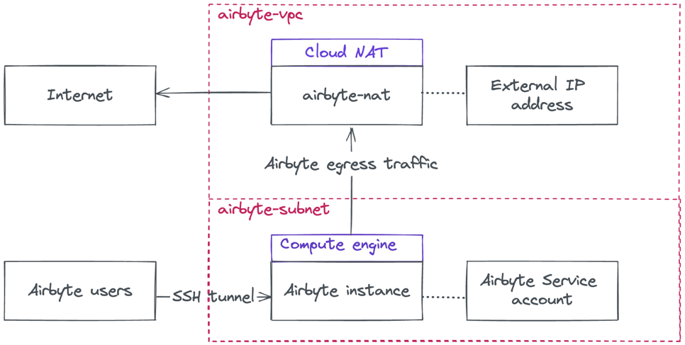

# terraform-google-airbyte-infra

A Terraform module to deploy an Airbyte server on a GCP compute engine instance.

- [Github repo](https://github.com/artefactory/terraform-google-airbyte-infra)
- [Terraform module registry](https://registry.terraform.io/modules/artefactory/airbyte-infra/google/latest)

## Prerequisites

- Terraform. Tested with v1.5.3
- A GCP project and an authenticated gcloud CLI

### Permissions

  - Broad roles that will work, but **not recommended** for service accounts or even people.
    - `roles/owner`
  - Recommended roles to respect the least privilege principle.
    - `roles/compute.admin`
    - `roles/iam.serviceAccountAdmin`
    - `roles/resourcemanager.projectIamAdmin`
  - Granular permissions required to build a custom role specific for this deployment.
    - `compute.addresses.create`
    - `compute.addresses.delete`
    - `compute.disks.create`
    - `compute.firewalls.create`
    - `compute.firewalls.delete`
    - `compute.instances.create`
    - `compute.instances.delete`
    - `compute.instances.setMetadata`
    - `compute.instances.setServiceAccount`
    - `compute.networks.create`
    - `compute.networks.delete`
    - `compute.networks.updatePolicy`
    - `compute.routers.create`
    - `compute.routers.delete`
    - `compute.routers.update`
    - `compute.routes.create`
    - `compute.routes.delete`
    - `compute.subnetworks.create`
    - `compute.subnetworks.delete`
    - `compute.subnetworks.use`
    - `iam.serviceAccounts.create`
    - `iam.serviceAccounts.delete`
    - `resourcemanager.projects.setIamPolicy`

## Usage

[Go to the `examples` directory to view deployment code samples.](https://github.com/artefactory/terraform-google-airbyte-infra/tree/main/examples)

Once deployment is successfully finished, you will need to SSH tunnel to your Airbyte instance:

```shell
$ gcloud compute ssh airbyte -- -L 8000:localhost:8000 -N -f
```

[You will then be able to access it via your browser](http://localhost:8000).

You may also Terraform the ELT flows themselves using the [Artefactory terraform-google-airbyte-flows module](https://registry.terraform.io/modules/artefactory/airbyte-flows/google/latest), or the [Airbyte community provider](https://registry.terraform.io/providers/josephjohncox/airbyte/latest).

## Architecture

This module will provision the following resources.



As a security precaution, the Airbyte VM is not reachable from the internet. The only way to access it is through gcloud-authenticated SSH. Egress traffic is of course possible to access remote data sources to pull data from.

The Airbyte service account has fairly high level of privilege on GCS and BQ (`roles/storage.objectAdmin`, and `roles/bigquery.dataEditor`), allowing it to read/write on any table or bucket. There permissions are required to allow Airbyte to create temporary datasets and tables. If that is an issue for you, you can isolate this deployment in a dedicated project.

--------
## Auto-generated module documentation

## Requirements

No requirements.

## Providers

| Name | Version |
|------|---------|
| <a name="provider_google"></a> [google](#provider\_google) | n/a |

## Modules

No modules.

## Resources

| Name | Type |
|------|------|
| [google_compute_address.airbyte_external_ip](https://registry.terraform.io/providers/hashicorp/google/latest/docs/resources/compute_address) | resource |
| [google_compute_firewall.allow_internal_traffic](https://registry.terraform.io/providers/hashicorp/google/latest/docs/resources/compute_firewall) | resource |
| [google_compute_firewall.allow_ssh_from_iap](https://registry.terraform.io/providers/hashicorp/google/latest/docs/resources/compute_firewall) | resource |
| [google_compute_instance.airbyte_vm](https://registry.terraform.io/providers/hashicorp/google/latest/docs/resources/compute_instance) | resource |
| [google_compute_network.airbyte_vpc](https://registry.terraform.io/providers/hashicorp/google/latest/docs/resources/compute_network) | resource |
| [google_compute_route.internet_route](https://registry.terraform.io/providers/hashicorp/google/latest/docs/resources/compute_route) | resource |
| [google_compute_router.router](https://registry.terraform.io/providers/hashicorp/google/latest/docs/resources/compute_router) | resource |
| [google_compute_router_nat.airbyte_nat](https://registry.terraform.io/providers/hashicorp/google/latest/docs/resources/compute_router_nat) | resource |
| [google_compute_subnetwork.airbyte_subnet](https://registry.terraform.io/providers/hashicorp/google/latest/docs/resources/compute_subnetwork) | resource |
| [google_project_iam_member.airbyte_iam](https://registry.terraform.io/providers/hashicorp/google/latest/docs/resources/project_iam_member) | resource |
| [google_service_account.airbyte](https://registry.terraform.io/providers/hashicorp/google/latest/docs/resources/service_account) | resource |

## Inputs

| Name | Description | Type | Default | Required |
|------|-------------|------|---------|:--------:|
| <a name="input_config"></a> [config](#input\_config) | Configuration for the Airbyte VM | <pre>object({<br>    vm_machine_type = optional(string, "e2-standard-2")<br>    vm_disk_size    = optional(number, 30)<br>    airbyte_vm_name = optional(string, "airbyte")<br>    airbyte_sa_name = optional(string, "airbyte")<br>    labels          = optional(map(string), {})<br><br>    vpc_name            = optional(string, "airbyte-vpc")<br>    subnet_name         = optional(string, "airbyte-subnet")<br>    ip_cidr_range       = optional(string, "10.0.1.0/24")<br>    router_name         = optional(string, "airbyte-router")<br>    external_ip_name    = optional(string, "airbyte-ip")<br>    nat_name            = optional(string, "airbyte-nat")<br>    internet_route_name = optional(string, "airbyte-internet-route")<br>    network_tags        = optional(list(string), [])<br>  })</pre> | `{}` | no |
| <a name="input_project_id"></a> [project\_id](#input\_project\_id) | GCP project id | `string` | n/a | yes |
| <a name="input_region"></a> [region](#input\_region) | GCP region | `string` | n/a | yes |
| <a name="input_zone"></a> [zone](#input\_zone) | GCP zone | `string` | n/a | yes |

## Outputs

| Name | Description |
|------|-------------|
| <a name="output_airbute_nat"></a> [airbute\_nat](#output\_airbute\_nat) | n/a |
| <a name="output_airbyte_address"></a> [airbyte\_address](#output\_airbyte\_address) | n/a |
| <a name="output_airbyte_router"></a> [airbyte\_router](#output\_airbyte\_router) | n/a |
| <a name="output_airbyte_service_account"></a> [airbyte\_service\_account](#output\_airbyte\_service\_account) | n/a |
| <a name="output_airbyte_subnet"></a> [airbyte\_subnet](#output\_airbyte\_subnet) | n/a |
| <a name="output_airbyte_vm_name"></a> [airbyte\_vm\_name](#output\_airbyte\_vm\_name) | n/a |
| <a name="output_airbyte_vpc"></a> [airbyte\_vpc](#output\_airbyte\_vpc) | n/a |
